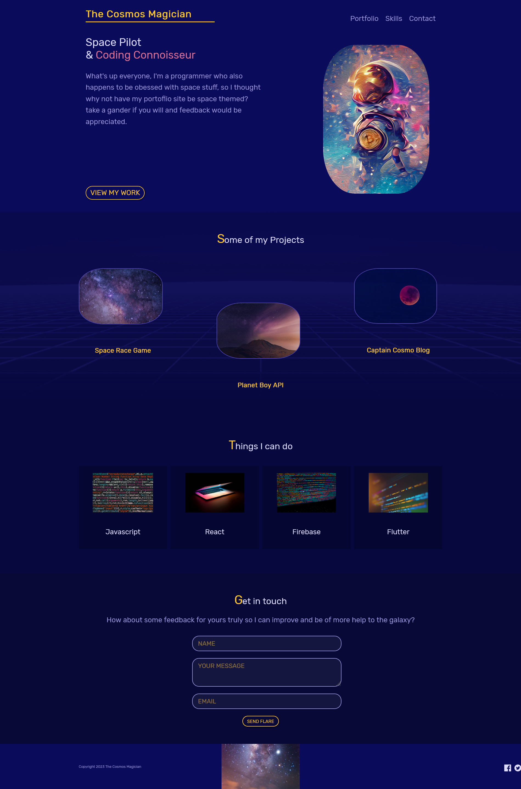

# The Cosmos Magician

## Table of contents

- [Overview](#overview)
  - [Screenshot](#screenshot)
  - [Links](#links)
- [My process](#my-process)
  - [Built with](#built-with)
  - [Continued development](#continued-development)
- [Author](#author)

## Overview

After my last project(challenge), I felt like I need to study more of - among other things of course - repsonsive design, especially with a mobile first approach which I haven't done before as I always started developing with Desktops in mind.

as promised, I took my time through multiple sources, and I plan to go through even more but as a start? I'm pretty proud of this one, I'd say it works marvelously from 375px all the way to desktop widths.
this project is based largely on the net ninja's "mobile first responsive build series https://www.youtube.com/watch?v=PM3XW_1RAIs&list=PL4cUxeGkcC9hH1tAjyUPZPjbj-7s200a4&index=1 " so lots of thanks goes out to him.

While I learned A LOT, I still however, take my time to improve many things for the project, it's been really fun and I tried to perfect it as much as possible with many changes in both code and aesthetics.

### Screenshot

### Links

- Live Site URL: [https://the-cosmos-magician-saif.netlify.app/]

## My process

Lots of grid, and a focus on responsiveness with a mobile first approach.

### Built with

- HTML
- CSS
- CSS Grid

### Continued development

- I'll do more mobile first approach from now on, need more pracitce with it.
- I'll get more in depth with rems vs ems, width vs max-widths, percentages and all that good stuff.
- REALLY need to get into background and all its related properties and practice it more.

## Author

- Frontend Mentor - [@SafeNSound95](https://www.frontendmentor.io/profile/SafeNSound95)
